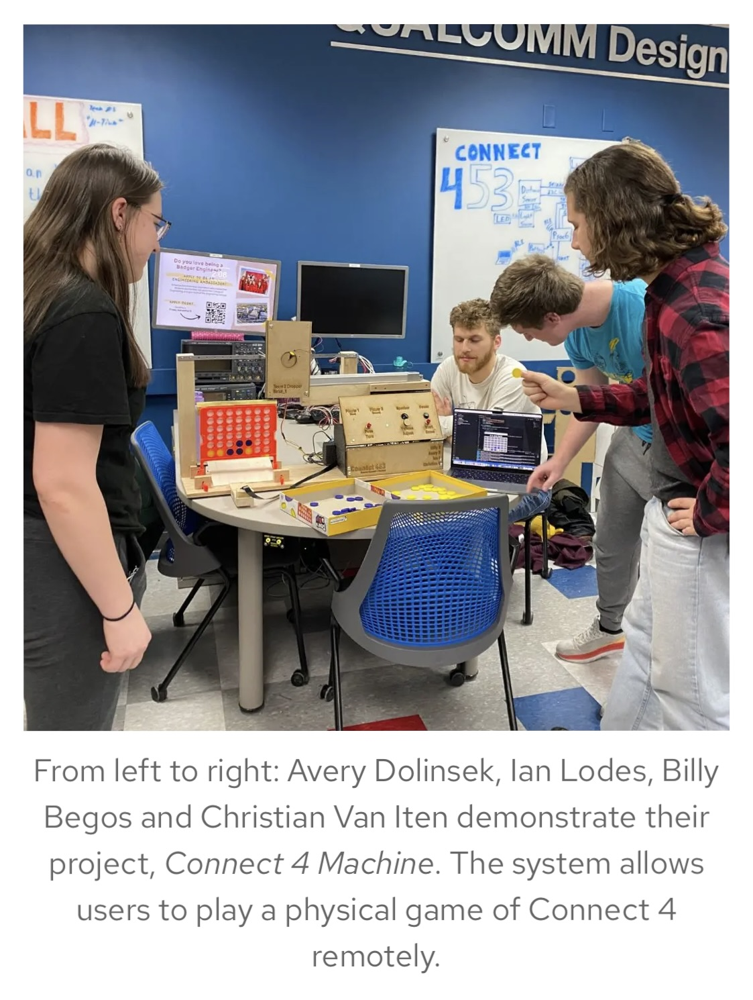

# Connect453
*Capstone project for ECE 453 at UW Madison - Fall 2023*

Connect453 is a machine that accepts a standard Connect 4 game board, and allows for remote play from a laptop (over BLE) for one of the two players.

This repository contains most of the software and hardware (Altium Designer project files) designed for the project.

## Picture

- Taken from UW Madison COE Blog (https://engineering.wisc.edu/blog/ece-453-students-present-capstone-projects-at-open-house/)

## Team members and roles
- Ian Lodes
    - Software for the microcontroller (Infineon PSoC6) board (game application, peripheral drivers, and BLE integration) 
    - PCB design of the microcontroller board (PSoC6 and speaker amplifier) and the relay board (drives a linear actuator)
    - Contribution to the UI (BLE integration and testing)
- Christian Van Iten
    - Software for the microcontroller board (I2C communication with the light sensor board)
    - PCB design of the light sensor board and the distance sensor board
    - Fabrication of the machine front panel and game piece dropper
- Billy Begos
    - Software for the Rasberry Pi (image capture and UART communication)
    - Software for the UI
- Avery Dolinsek
    - PCB design of the motor driver board
    - Construction of the machine frame base

## Software frameworks used
- FreeRTOS
- [Infineon 'bless' BLE stack](https://github.com/Infineon/bless)
- [Infineon HAL](https://github.com/Infineon/mtb-hal-cat1)
- Kivy
